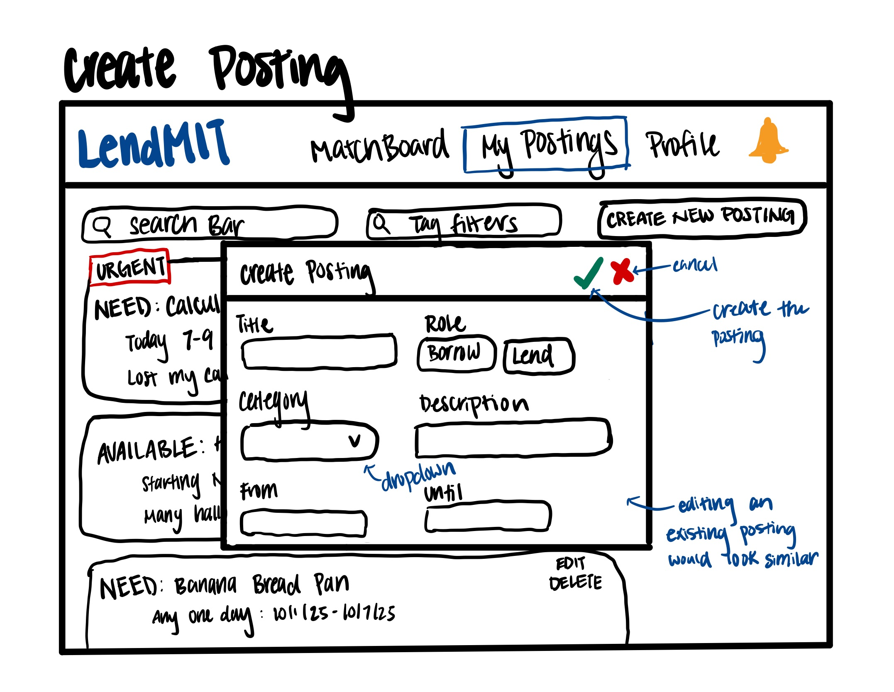

# Assignment 2: Functional Design

## Problem Statement
### Problem Domain: Borring and Lending Items with Peers
Many students regularly borrow and lend items, such as chargers, tools, or clothing from their peers. This typically happens within a dorm, friend group, or some other social circle. I care deeply about this domain because borrowing and lending has saved me a lot of money and stress, especially in urgent situations; for example, when my roommate lent me a calculator right before my 15.501 exam when I had realized I lost mine. Beyond just convenience, sharing items reduces unnecessary purchases and waste. Why buy a completely new tool for a one-time use? However, despite these benefits, informal borrowing and lending is rather inefficient and oftentimes discouraging.
### Key Problem: Hard to Find a Match
When someone suddenly needs an item, the biggest problem is quickly finding someone nearby who is willing and able to lend it. That often relies on personal connections, texting friends, or asking around, which may be slow, not yield results in time, and heavily rely on the size of your network. There are lenders who would be happy to help who never hear about these needs. This disconnect wastes time, wastes money, creates stress in urgent situations, and discourages sustainability.
### Stakeholders:
- Borrowers: seeking timely access to items, oftentimes in urgent or one-off situations.
- Lenders: wants to help others and make better use of their resources but risk inconvenience or loss of their belongings.
- Community: benefits from item-sharing that saves money, reduces waste, and fosters trust within communities, but may also be strained from negative lending interactions, such as lost or damaged items.
### Evidence:
1. [*Wikipedia — Borrowing center*](https://en.wikipedia.org/wiki/Borrowing_center) — Many cities have started "borrowing centers" where people can reliably checkout tools, equipment, and other goods. This shows demand for item sharing and demonstrates that informal peer-to-peer matching alone is often insufficient.
2. [*Tool Lending Libraries Study*](https://www.diva-portal.org/smash/get/diva2%3A1192733/FULLTEXT01.pdf) — Reports show people often seek borrowing for urgent, short-term needs such as a drill for a one-time job. If they can't find someone to match with for the request quickly, they give up and buy the item instead.
3. [*Libraries of Things: Challenges and Opportunities in Community Sharing*](https://dl.acm.org/doi/10.1145/3544548.3581094) — This study examines community-run "Library of Things" where community members share tools, kitchen gadgets, gear, etc. Even when items were available within the community, people still found it hard to find what they need in time, showing that the bottleneck isn't supply but connecting people.
4. [*Challenges in designing an inclusive Peer-to-peer (P2P) lending system*](https://dl.acm.org/doi/fullHtml/10.1145/3598469.3598475) — This paper identifies that discovery, visibility, and communication barriers as the challenges to inclusive matching in a peer-to-peer system.
5. [*ShareSpace prototype for research*](https://arxiv.org/abs/2411.11527) — ShareSpace is a campus-based sharing app prototype to let students buy and sell goods to address sustainability and affordability. The research talked about students' lack of access to affordable resources, poor circulation of resources, and wasted surplus of resources by graduating seniors.
6. [*Shared, Collaborative and On Demand: The New Digital Economy*](https://www.pewresearch.org/internet/2016/05/19/the-new-digital-economy/) — Pew Research found that 72% of Americans have some sort of shared or on-demand service. This shows that there's string interest and willingness to share, lend, and borrow.
7. [*Borrowing from Friends of Friends: Indirect Social Networks and Bank Loans*](https://pubsonline.informs.org/doi/10.1287/mnsc.2024.07536) — This study shows how indirect connections, such as friends of friends, can influence lending opportunities. It argues that when direct connections don't work out, borrowers must rely on more distant connections which lower the chances of getting matched.
### Comparables:
1. [*Mooch*](https://www.moochapp.com/) — Mooch is an app that allows you to borrow, lend, and track your items within a private group of friends. This reduces the need to awkwardly ask around to borrow or get your items back.
2. [*Fat Llama*](https://fatllama.com/us) — Fat Llama allows people to rent items instead of buying. It allows you to query a location and time to find the most fitting lenders.
3. [*BorrowDirect*](https://library.princeton.edu/services/borrowdirect) — BorrowDirect is a loan service offered by Princeton University that allows students/faculty to request to borrow available items. This addresses the matching problem but relies on the school itself to operate.
4. [*Buy Nothing Project*](https://buynothingproject.org/) — This is a network of groups that promote people to share goods rather than purchasing to reduce waste, save money, and build community. But this doesn't really scale well for time-sensitive needs like borrowing a charger in between classes.
5. [*Peerby*](https://www.peerby.com/en-us) — A neighborhood-based borrowing and lending platform that lets borrowers post requests and lenders post their available belongings that are broadcasted to nearby users.

## Application Pitch
### Name: LendMIT
### Motivation:
MIT students often waste time and money scrambling to find someone who has what they need, like a charger, calculator, or bike pump, because borrowing currently depends heavily on personal connections and word-of-mouth.
### Features:
1. **Campus-Wide Matchboard:** A searchable, campus-exclusive directory where MIT students can list items they're willing to lend and browse or post what they need to borrow. This helps break the dependency on personal connections and makes it easy to discover potential lenders or borrowers anywhere on campus. Borrowers save time and stress by quickly finding matches even outside their social circle. Lenders get more opportunities to share items that would otherwise sit unused. Campus community reduces waste, builds relationships, and is better connected through efficient sharing of resources.
2. **QuickRequest Alerts:** A fast and time-sensitive request system that lets students broadcast their urgent needs (e.g., "Need a calculator by 7pm") via push notifications. This would help spread the word instantly for urgent requests so potential lenders can respond quickly. Borrowers would feel supported and less stressed in urgent situations and avoid last-minute purchases of something they may only need once. Lenders would feel good about helping someone in an urgent situation when it matters most. Campus community benefits from fewer redundant purchases and a stronger sense of mutual aid.
3. **MatchTags:** A tagging and alerting system where students can tag categories of items they're interested in borrowing or are willing to lend, like "chargers," "jewelry," or "formal attire," and receive notifications whenever a relevant listing or request is posted. This helps reduce the need to constantly check for new listings and requests and makes it more likely that potential matches actually discover each other in a timely manner. Borrowers save effort and avoid missing opportunities to borrow what they need. Lenders see higher demand for their items, which encourages them to participate more. Campus community benefits from faster and more reliable matching that helps foster relationships.

## Concept Design
### Concept 1: User
```
concept User
purpose: provides an identity for each participant in the system so that actions can be tied to real people.
principle: a user begins by registering with their email, name, and password; the user goes into a PENDING status until they verify their email, after which they become a REGISTERED user; users can later deactivate their accounts.

state
    a set of Users with
        an email String
        a firstName String
        a lastName String
        a password String
        a status of PENDING OR REGISTERED or DEACTIVATED

actions
    registerUser(email: String, password: String, firstName: String, lastName: String)
        requires: no existing User with this email
        effect: a new User is created with the given email, password, firstName, lastName, and status = PENDING

    changePassword(user: User, newPassword: String)
        requires: given user's status is REGISTERED
        effect: user's password becomes newPassword

    activateUser(user: User)
        requires: given user's status is PENDING
        effect: user's status becomes REGISTERED

    deactivateUser(user: User)
        requires: given user's status is REGISTERED
        effect: user's status becomes DEACTIVATED

Note: in our case, an MIT email is needed to verify that they're a student.
```

### Concept 2: EmailAuth
```
concept EmailAuth[User, Time]
purpose: verifies ownership of an email address.
principle: the system generates a verification code and delivers it to the email address provided; the person must present that code before the verification expires in order to prove ownership.

state
    a set of EmailAuth with
        a user User
        a code String
        an expiry Time
        a verified Flag

actions
    sendVerificationCode(user: User)
        effects: a new EmailAuth is created for user with a fresh code, expiry in the future, and verified = FALSE

    verifyCode(user: User, code: String)
        requries: an EmailAuth exists for user whose code matches and whose expiry is in the future
        effect: that EmailAuth becomes verified = TRUE

    revokeVerification(user: User)
        requries: an EmailAuth exists for user
        effect: that EmailAuth record is removed
```

### Concept 3: Posting
```
concept Posting[User, Time]
purpose: represents a time-bounded intention of a user to either lend or borrow.
principle: a user creates a posting with a name, description, category, role (borrower or lender), and time window. The posting is initially active; the user may later update the posting or delete it. If a counterpart is found, the posting is marked as fulfilled; if the time window passes without fulfillment, the posting becomes expired.

state
    a set of Postings with
        an owner User
        a role of BORROWER or LENDER
        a name String
        a category String
        an optional description String
        an optional availableFrom Time // if not given, availableFrom = current time
        an optional availableUntil Time // if not given, availableUntil = indefinite
        a status of ACTIVE or FULFILLED or CANCELLED or EXPIRED

actions
    createPosting(owner: User,
                  role: BORROWER or LENDER,
                  name: String,
                  category: String,
                  description: String?,
                  availableFrom: Time?,
                  availableUntil: Time?)
        requires: availableFrom and availableUntil if given forms a valid time window
        effect: a new Posting is created with the given attributes; if availableFrom is not given, set it to current time; if availableUntil is not given, set it to indefinite; status is set to ACTIVE

    updatePosting(posting: Posting,
                  newName: String?,
                  newCategory: String?,
                  newDescription: String?,
                  newAvailableFrom: Time?,
                  newAvailableUntil: Time?)
        requires: given posting's status to be ACTIVE; if provided, the new time window must be valid; at least one of the optional attributes must be given.
        effect: posting is updated with any of the attributes that are given: newName, newCategory, newDescription, newAvailableFrom, and newAvailableUntil

    cancelPosting(posting: Posting)
        requires: posting's status to be ACTIVE
        effect: posting's status becomes CANCELLED

    fulfillPosting(posting: Posting)
        requires: posting's status to be ACTIVE
        effect: posting's status becomes FULFILLED

    expirePosting(posting: Posting)
        requires: posting's status to be ACTIVE and current time is after posting's availableUntil
        effect: posting's status becomes EXPIRED

    deletePosting(posting: Posting)
        requires: posting's status to be CANCELLED, FULFILLED, OR EXPIRED
        effect: posting is removed from the set of Postings
```

### Concept 4: Subscriptions
```
concept Subscriptions[User, Tag, Event]
purpose: allows a user to express interest in a certain category (tag) so they can be notified when relevant events occur.
principle: a user subscribes to a tag (or to multiple) that represents a category of interest; the user can later unsubscribe. Whenever an event occurs that is associated with a tag matching the subscription, the system creates a notification for that user.

state
    a set of Subscriptions with
        a subscriber User
        a tag Tag

    a set of Notifications with
        a recipient User
        an event Event
        a delivered Flag

actions
    subscribe(subscriber: User, tag: Tag)
        requires: user exists and is valid
        effect: a new Subscription is created linking the subscriber to that tag

    unsubscribe(subscriber: User, tag: Tag)
        requires: a Subscription exists for subscriber and given tag is in that user's tags
        effect: that tag is removed from tags

    generateNotification(event: Event)
        requires: given event is valid
        effect: for each Subscription whose tag matches the tag of event, a new Notification is created for that subscriber with delivered = FALSE

    markNotificationDelivered(notification: Notification)
        requries: notification's delivered is FALSE
        effect: notification's delivered becomes TRUE

    clearNotifications(notification: Notification)
        requires: notification's delivered is TRUE
        effect: notification is removed from set of Notifications

    removeAllSubscriptions(subscriber: User)
        requires: given subscriber exists in Subscriptions
        effect: all Subscriptions with given subscriber are removed

    removeAllNotifications(recipient: User)
        requires: given recipient exists in Notifications
        effect: all Notifications with given recipient are removed

Note:
- The generic type Events would be Postings in our scenario.
- In generateNotifications, a valid event would be one that has a category and is active in our scenario.
- A tag corresponds to a category in Postings.
```

### Sync 1: Send Verification on Register
```
sync sendVerificationOnRegister

when User.registerUser(user)
then EmailAuth.sendVerificationCode(user)
```

### Sync 2: Verify Before Activate
```
sync verifyBeforeActivate

when EmailAuth.verified(user) == TRUE
then User.activateUser(user)
```

### Sync 3: Notify on New Posting
```
sync notifyOnNewPosting

when Posting.createPosting(posting)
then Subscriptions.generateNotification(posting)
```

### Sync 4: Notify on Update
```
sync NotifyOnUpdate

when Posting.updatePosting(posting, newCategory)
then Subscriptions.generateNotification(posting)

```

### Sync 5: Clean Up on User Deactivation
```
sync cleanUpUserDeactivation

when
    User.deactivateUser(user)
then
    Subscriptions.removeAllSubscriptions(user)
    Subscriptions.removeAllNotifications(user)
```

### Explanation:
- The *User* concept provides the foundation for all other concepts by giving each person an identity. Actions in other concepts, such as creating postings or subscribing to tags refer to users generically so that responsibilities and permissions can be tracked.
- The EmailAuth[User, Time] concept enforces that only students who can prove their identity as an MIT student through their MIT email can access the app. This concept ties directly to the User concept: newly registered users start in a pending state, and only after email verification succeeds do they become fully registered in the User concept. This acts as an access-control mechanism for using the rest of the app.
- The Posting[User, Time] concept represents the core matching activity of the app: borrowers and lenders create postings with all the necessary information about their requested or offered item. Postings are the primary event that other concepts respond to.
- The Subscriptions[User, Tag, Event] concept captures user's standing interest in certain categories (or tags). Tag is the generic type used to represent a category in the Posting concept. When a posting is created or updated, the system automatically generates a notification for interested subscribers in that post's tag. This concept helps decouple interest-tracking from postings so that users don't need to constantly search for new postings.
- **Generic Types:** *User* in EmailAuth and Subcriptions is the same one defined in the User concept. *Time* in EmailAuth and Posting is a basic timestamp type. *Event* in Subscriptions is instantiated by Posting, since postings are the events that drive notifications. *Tag* in Subscriptions correspond to the category field of postings, which is what users subscribe to.


## UI Sketches
### Match Board
Search bar and filter by tag at the top under the navigation bar for browsing items by category. Below, users see a scrollable list of postings displayed as cards with item's name, time window, and description. In each card, you can see whether the item is being requested by a borrower or offered by a lender. Urgent QuickRequests are highlighted and pinned at the top so they are immediately visible.


### Posting Details
The Posting Details page opens when a user clicks a posting on the Match Board. It displays all the information previously on the Match Board and the entire description if it was too long to be displayed before. Further, there is a way to contact the owner of the post to either lend to borrow. Clicking the "X" in the top right corner will return back to the Match Board.


### My Postings
My Postings is a page that mimics the visuals of the Match Board but for the user's own postings. For every posting, the user is able to edit and delete. The pop-up for editing a posting is very similar to the pop-up for creating a posting (look below). There is also a button to cerate a new posting.


### Create Postings
The Create Posting is a popup that opens for creating a posting. Editing a posting of your own will also have a pop-up like this. It includes fields for title, role (as borrower or lender), category via dropdown, description, and time window. If the role of borrower is selected, then an additional field will pop up asking if it's an urgent request. Checking that will make this a QuickAlert request, which sends a notification to the entire user base. The check button on the top right will create the posting and the "X" button will cancel the posting. Both buttons will close the popup and return to the My Postings page.


### Notification and Subscription Bar
The notification and subscriptions page can be navigated to by pressing the bell icon on the far right of the navigation bar. The page is split into two panels. On the left is a vertical list of categories/tags the user has subscribed to, each with an "Unsubscribe" button. On the right is a list of notifications in chronological order. Unread notifications are highlighted gray, and each has a "View" link that takes the user to the Posting Details page for that posting.


## User Journey
It is the night before the accounting (15.501) exam, and Jenna, an MIT student, realizes that her basic, non-scientific calculator is missing! She needs one for her 1PM exam the next day, but it's too late to go buy one and none of her close friends have one available. She feels stressed and remember that LendMIT exists to help students borrow items in urgent situations.

Jenna downloads LendMIT, creates an account, and verifies her MIT email, which then launches her on the Match Board page. She types "calculator" into the search bar and sees a few active postings from lenders who are offering calculators. She clicks into the details of every one of those postings, but none of them are offering non-scientific calculators as required by her exam policy.

Jenna instead decides to make her own urgent QuickRequest posting. From the navigation bar, she clicks into the My Postings page and selects to create a new posting. She specifies that she needs to borrow a non-scientific calculator by tomorrow 1PM and marks it as urgent, and submits it. Her posting now shows in her My Postings page, and it also shows on the top of the Match Board page as "URGENT".

Meanwhile, all users of LendMIT receive a notification through the Notifications and Subscriptions page that a new urgent request has been posted. One of them, Tim, sees the notification a few minutes later, clicks "View," reads Jenna's posting, realizes he can offer his calculator, and contacts Jenna through the Posting Detail's page.

Jenna and Tim coordinate to meet at the Student Union at 11AM the next morning for pick up. They also coordinated to return the calculator the day after that at the same time and place. Jenna borrows the calculator in time for her exam and later marks her posting as fulfilled. The day after the exam, she returns the calculator to Tim as planned. Jenna is super relieved that she avoided the hassle and expense of a last-minute purchase and appreciates how quickly LendMIT helped find her a match.
